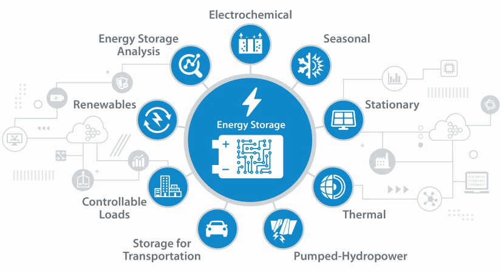

<h1 align="center">:wave: Welcome to SESR Group </h1>

  
   

Welcome to the **GitHub Homepage** of the  **Sustainable Energy Storage & Recycling Group** led by **Dr.Nikiforidis Georgios** at the **University College London**. 

The **Sustainable Energy Storage & Recycling Group**(SESR Group)'s mission is to advance the development and implementation of **sustainable energy storage materials and technologies**, focusing on the **circular economy of electric vehicle (EV) batteries**, **bio-energy production**, and **green electrolyte engineering**.

<!--   GreenHydrogen -->

SESRG is lead by [Dr.Nikiforidis Georgios](https://scholar.google.com/citations?user=EufoqsMAAAAJ&hl=en&oi=ao) and excuted by [Mr. Haotian Ma](https://github.com/TSdreamer). SESRG is located at the [University College London](https://www.ucl.ac.uk/) , in the [School of Chemistry](https://www.ucl.ac.uk/chemistry/) [Institute for Material Discovery](https://www.ucl.ac.uk/institute-for-materials-discovery/about).

<!-- GreenEnergy-->

For more information on the type of projects being pursued by the SESR Group, take a look at the publications page of [Dr.Nikiforidis Georgios](https://scholar.google.com/citations?user=3D4G2t8AAAAJ&hl=en&oi=ao).
