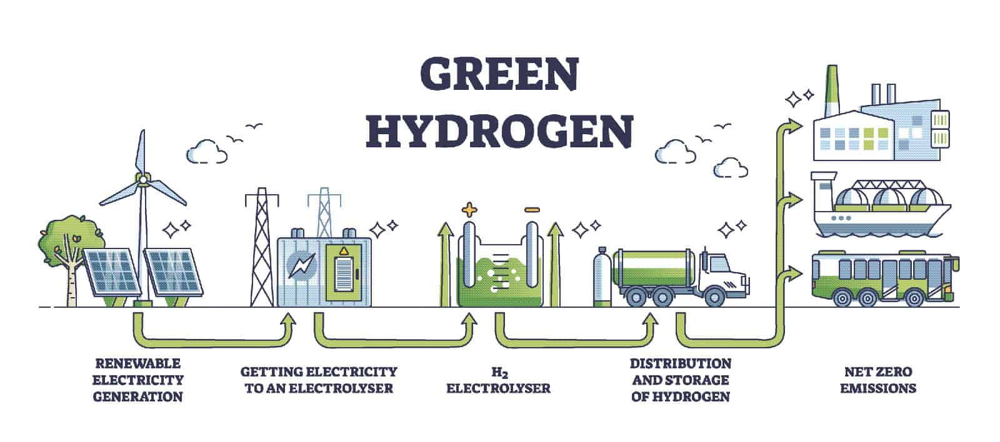

<h1 align="center">:wave: Welcome to GEDPL </h1>

  
   

Welcome to the **GitHub Homepage** of the  **Intelligent Energy System Lab** led by **Prof.Sai Gu** at the **University of Warwick**. 

The **Intelligent Energy System Lab**(IESL) focuses on the study of hydrogen economy, pays closed attention to the **functionalized materials** including **electrodes**, **membranes**,**catalysts**, and **porous transport layer**. By applying **machine learning** and **virtural reality** tools,we further enhance the impact of our research and make it significant to change the daily life. 

<!--   GreenHydrogen -->

GEDPL is lead by [Prof. Sai Gu](https://scholar.google.com/citations?user=EufoqsMAAAAJ&hl=en&oi=ao) and excuted by [Mr. Haotian Ma](https://github.com/TSdreamer). GEDPL is located at the [University of Warwick](https://warwick.ac.uk/) , in the [School of Engineering](https://warwick.ac.uk/fac/sci/eng/).

<!-- GreenEnergy-->

For more information on the type of projects being pursued by the GEDPL team, take a look at the publications page of [Prof. Sai Gu](https://scholar.google.com/citations?user=EufoqsMAAAAJ&hl=en&oi=ao).
